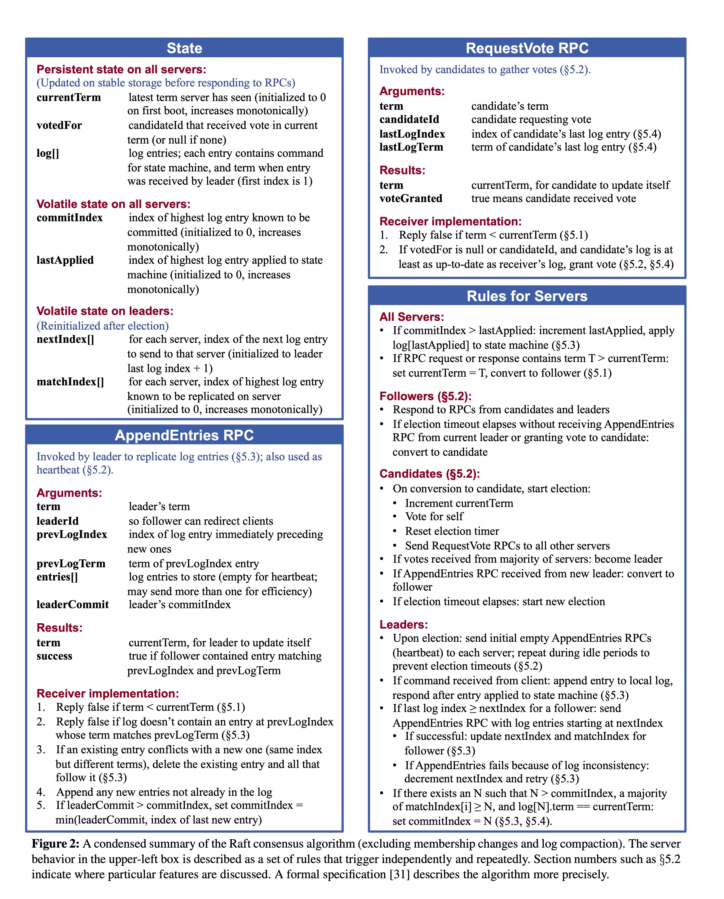

# RAFT

This project implements a replicated log using the Raft protocol, using RPC to communicate between replicas. This implements parts of the Raft protocol as described in the extended Raft paper [In Search of an Understandable Consensus Algorithm](https://raft.github.io/raft.pdf). The implementation closely follows the following figure:



Persistence, cluster membership changes (Section 6) or log compaction (Section 7) are not implemented. A more detailed specification of the project is available in the [Writeup](./p2_24.pdf).

## Project Structure

The project code is organized as follows:

```
src/github.com/cmu440/
  raft/                            Raft implementation, tests and test helpers

  rpc/                             RPC library that is used for implementing Raft

```

### Executing the official tests

To execute all the tests, run the following from the `src/github.com/cmu440/raft/` folder

```sh
go test
```

To check for race conditions, run the test with Go's race detector:

```sh
go test -race
```

## Miscellaneous

### Reading the API Documentation

You can read the documentation in a browser:

1. Install `godoc` globally, by running the following command **outside** the `src/github.com/cmu440` directory:

```sh
go install golang.org/x/tools/cmd/godoc@latest
```

2. Start a godoc server by running the following command **inside** the `src/github.com/cmu440` directory:

```sh
godoc -http=:6060
```

3. While the server is running, navigate to [localhost:6060/pkg/github.com/cmu440](http://localhost:6060/pkg/github.com/cmu440) in a browser.
